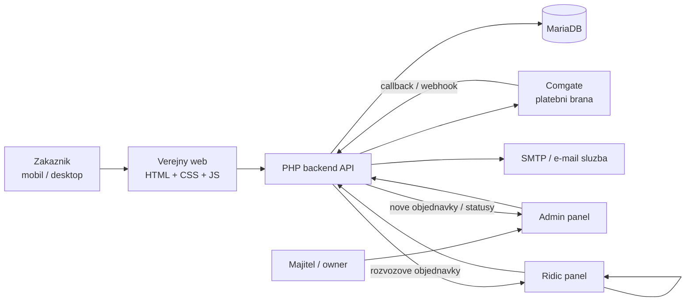
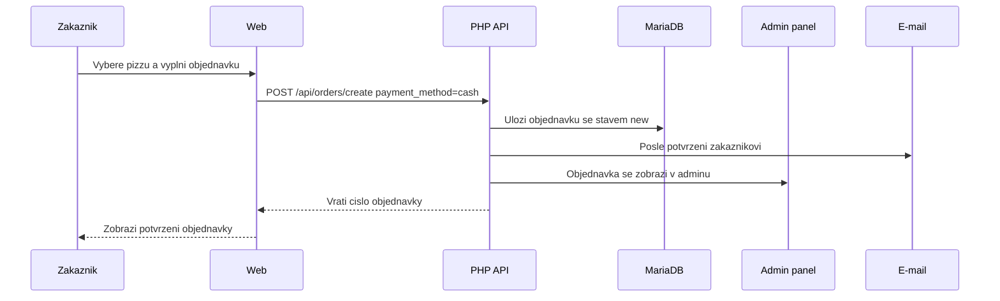
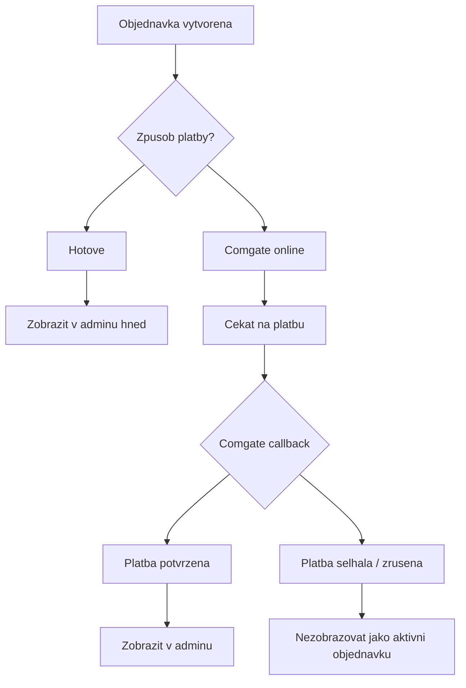
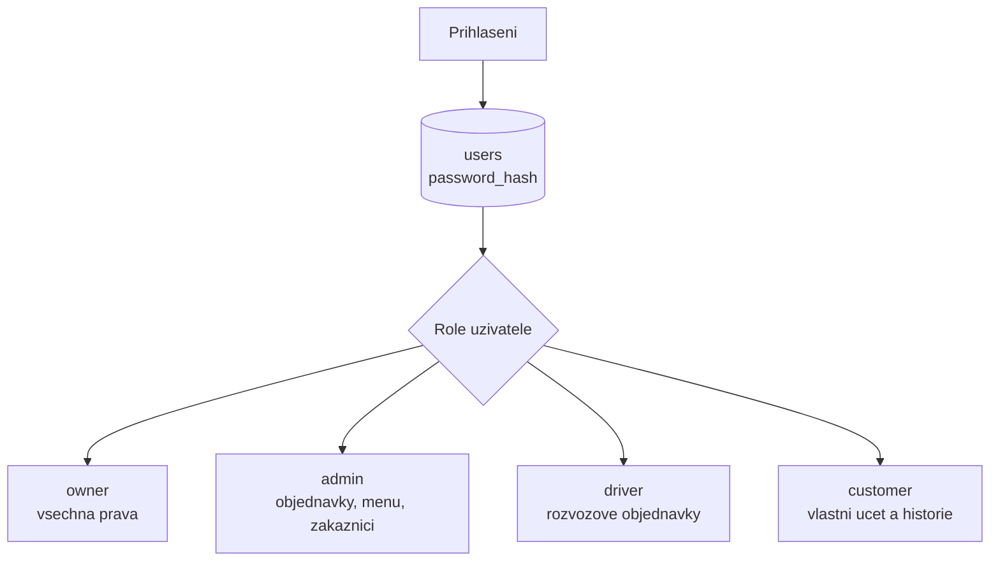
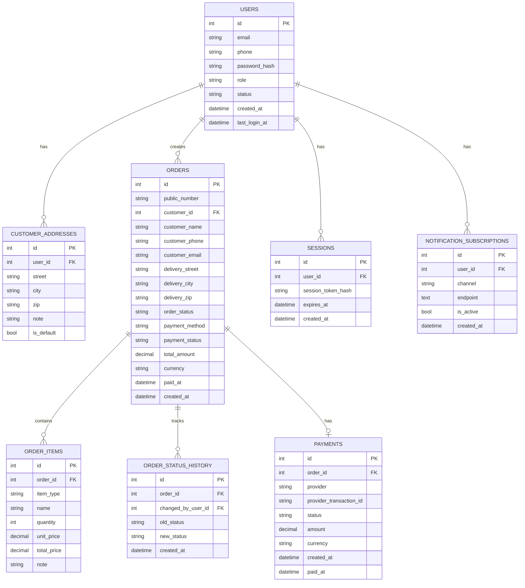
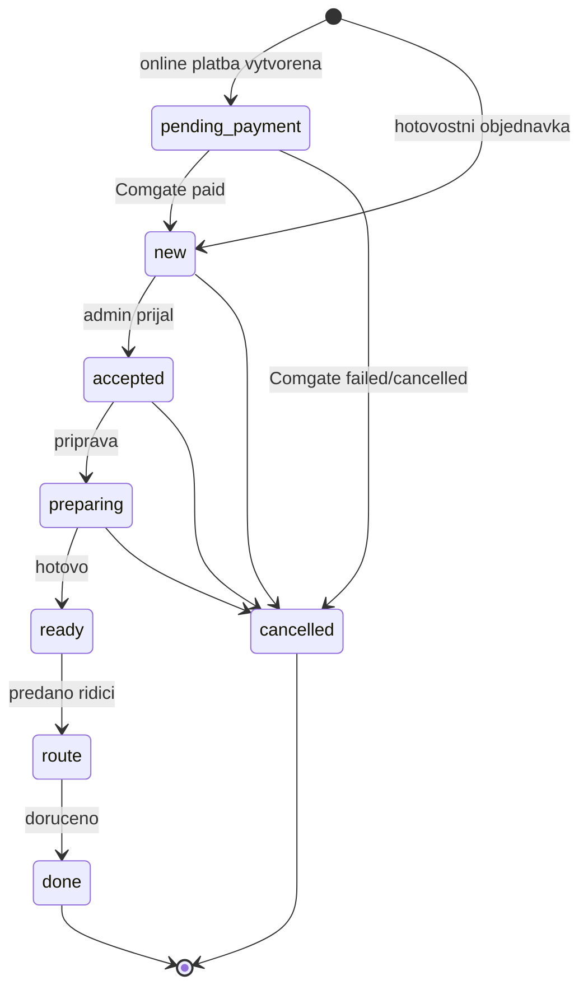
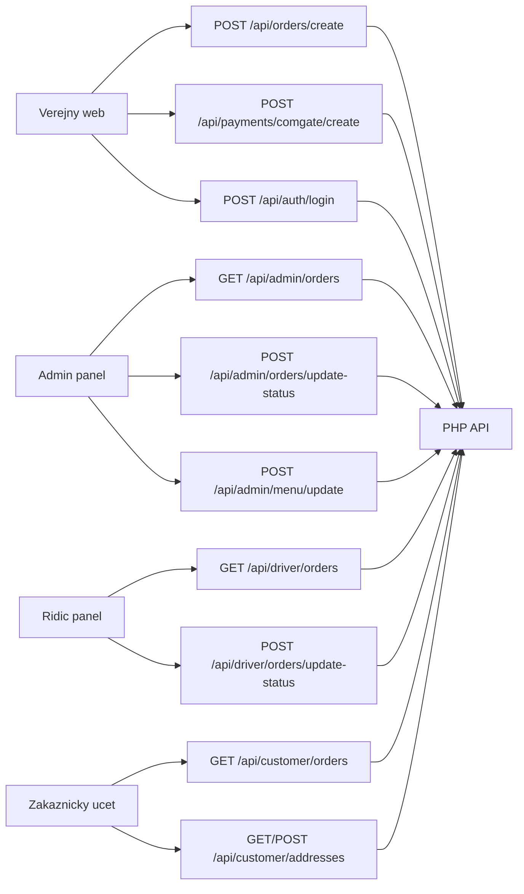
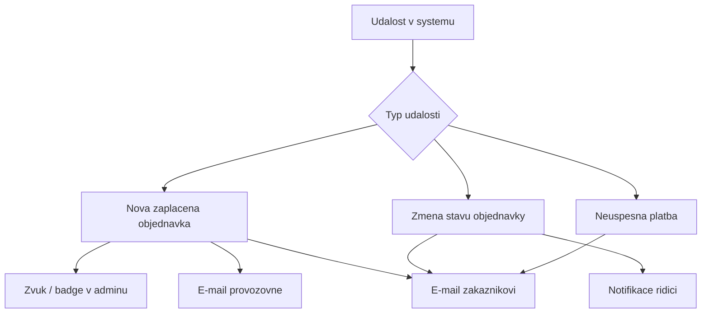

# Pizza Bellizzi - navrh systemu

Tento dokument kresli doporucenou architekturu pro objednavkovy system Pizza Bellizzi:

- verejny web s kosikem
- PHP backend API
- MariaDB databaze
- admin panel
- rozhrani pro ridice
- zakaznicke ucty
- online platby pres Comgate
- e-mailove a interni notifikace

## Celkova architektura



## Tok objednavky pri platbe hotove



## Tok objednavky pri online platbe Comgate

Objednavka se v adminu zobrazi az po potvrzeni zaplaceni z Comgate callbacku.


## Pravidlo pro zobrazeni objednavky v adminu



Prakticky filtr pro admin:

```sql
SELECT *
FROM orders
WHERE payment_method = 'cash'
   OR payment_status = 'paid';
```

## Role a prihlaseni

Aplikace se do databaze nepripojuje jako databazovy `root`. Pouzije se samostatny databazovy uzivatel, napr. `pizza_app`.

Uzivatelska data se ukladaji do tabulky `users`. Hesla se nikdy neukladaji jako text, pouze jako hash.



## Navrh databaze



## Stavy objednavky



## API endpointy



## Notifikace



## Doporuceny stack

```txt
Frontend:
  HTML + CSS + JavaScript

Backend:
  PHP 8.2/8.3

Databaze:
  MariaDB

Platby:
  Comgate API + server callback

E-maily:
  SMTP / MailerSend / Postmark / SendGrid

Prihlaseni:
  PHP sessions nebo vlastni session tabulka
  password_hash()
  password_verify()

Hosting:
  PHP hosting nebo male VPS
```

