# Pizza Bellizzi - navrh systemu

Tento dokument kresli doporucenou architekturu pro objednavkovy system Pizza Bellizzi:

- verejny web s kosikem
- PHP backend API
- MariaDB databaze
- admin panel
- rozhrani pro ridice
- zakaznicke ucty
- verejne sledovani stavu objednavky pres bezpecny odkaz
- finalni cislo objednavky podle prihlaseneho admina
- logy prihlaseni a audit akci
- databaze zakazniku pro naseptavac
- rozvozove zony a ceny rozvozu
- online platby pres Comgate
- e-mailove a interni notifikace

## Celkova architektura

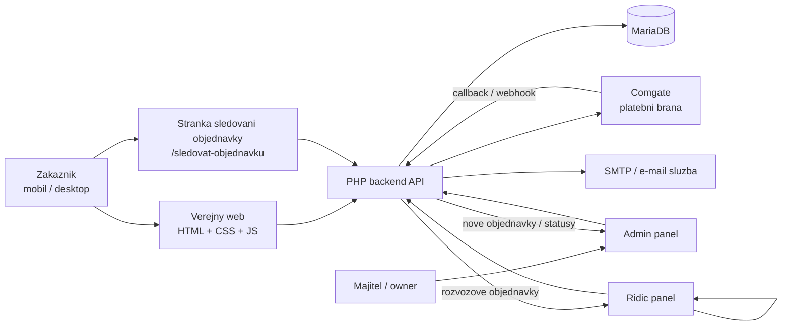

## Tok objednavky pri platbe hotove

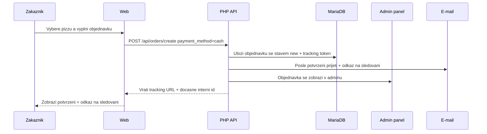

## Tok objednavky pri online platbe Comgate

Objednavka se v adminu zobrazi az po potvrzeni zaplaceni z Comgate callbacku.

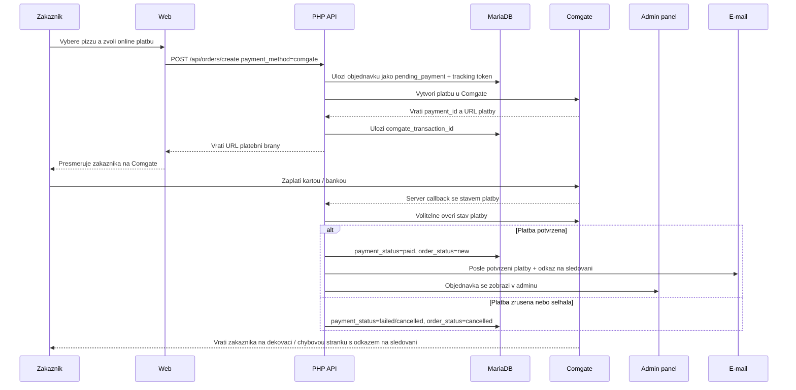

## Pravidlo pro zobrazeni objednavky v adminu

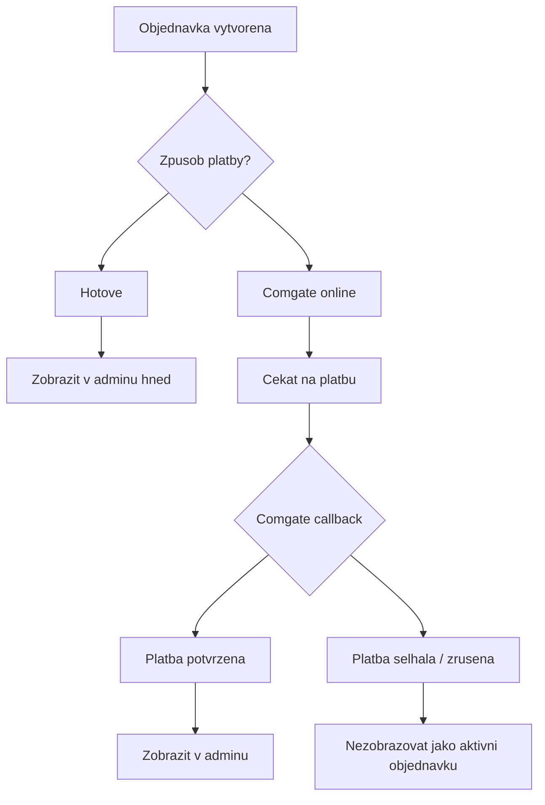

Prakticky filtr pro admin:

```sql
SELECT *
FROM orders
WHERE payment_method = 'cash'
   OR payment_status = 'paid';
```

## Sledovani objednavky pro zakaznika

Kazda objednavka dostane verejny tracking odkaz, ktery se:

- zobrazi na webu po dokonceni objednavky
- posle zakaznikovi v potvrzovacim e-mailu
- pouzije pro sledovani stavu bez prihlaseni

Odkaz nesmi obsahovat jednoduche ID objednavky. Ma obsahovat dlouhy nahodny token, napr.:

```txt
https://pizzabellizzi.cz/sledovat-objednavku/tk_8b4c9f7a...dlouhy-token
```

V databazi je lepsi ulozit jen hash tokenu, ne samotny token.

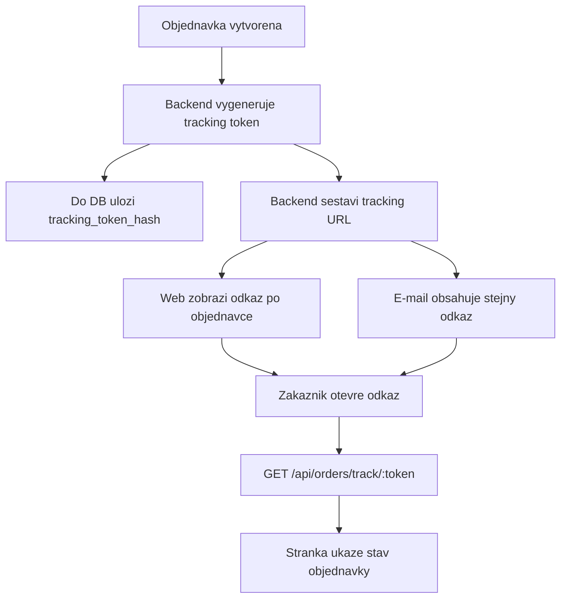

### Timeline pro zakaznika

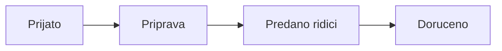

Mapovani internich stavu na text pro zakaznika:

```txt
new       -> Cekame na prijeti objednavky
accepted  -> Prijato
preparing -> Priprava
route     -> Predano ridici
done      -> Doruceno
```

Pokud je objednavka online a platba jeste neni potvrzena, tracking stranka muze ukazat:

```txt
Cekame na potvrzeni platby
```

## E-mail s odkazem na sledovani

Potvrzovaci e-mail zakaznikovi ma obsahovat cislo objednavky, souhrn objednavky a tlacitko/odkaz:

```txt
Predmet: Pizza Bellizzi - prijali jsme vasi objednavku

Dekujeme za objednavku.
Finalni cislo objednavky uvidite po prijeti provozovnou.

Stav objednavky muzete sledovat zde:
https://pizzabellizzi.cz/sledovat-objednavku/tk_8b4c9f7a...dlouhy-token
```

Po kliknuti admina na `Prijmout objednavku` se zakaznikovi muze poslat aktualizace:

```txt
Predmet: Pizza Bellizzi - objednavka 260710FP142533 prijata

Objednavka byla prijata provozovnou.
Cislo objednavky: 260710FP142533

Stav objednavky muzete sledovat zde:
https://pizzabellizzi.cz/sledovat-objednavku/tk_8b4c9f7a...dlouhy-token
```

## Role a prihlaseni

Aplikace se do databaze nepripojuje jako databazovy `root`. Pouzije se samostatny databazovy uzivatel, napr. `pizza_app`.

Uzivatelska data se ukladaji do tabulky `users`. Hesla se nikdy neukladaji jako text, pouze jako hash.

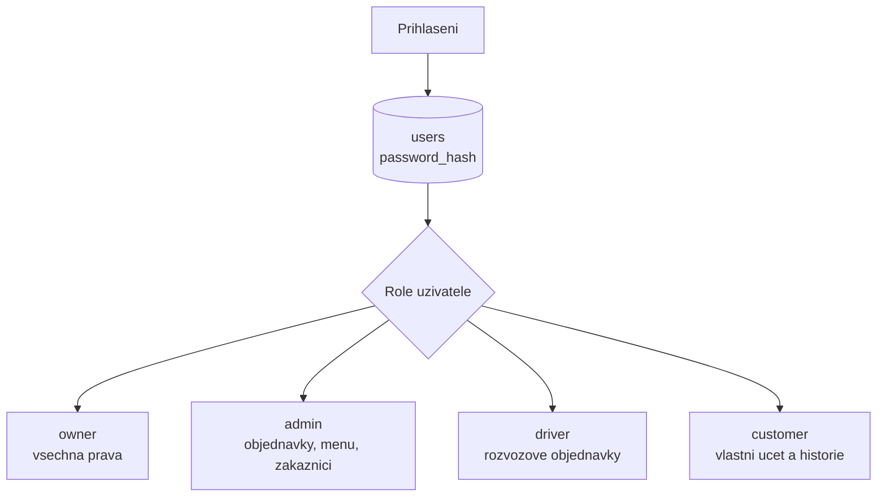

## Cislo objednavky

Finalni cislo objednavky se vygeneruje ve chvili, kdy ji v adminu prijme konkretni prihlaseny uzivatel.

Format:

```txt
RRMMDD + INICIALY_ADMINA + HHMMSS
```

Priklad:

```txt
260710FP142533
```

Vysvetleni:

```txt
26      = rok 2026
07      = mesic cervenec
10      = den
FP      = inicialy prihlaseneho admina, ktery objednavku prijal
142533  = cas prijeti 14:25:33
```

Poznamka: objednavka z webu existuje uz pred prijetim adminem. Do te doby ma interni `id`, tracking token a stav `new`, ale finalni `public_number` se doplni az pri akci `admin prijal`.

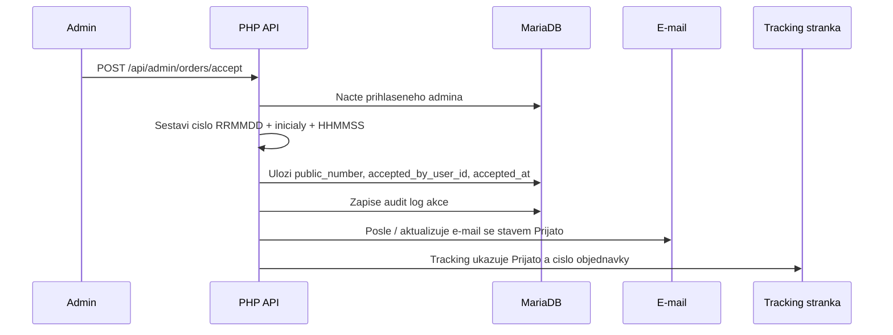

Pro jistotu ma byt na `orders.public_number` unikatni index. Pokud by dva admini se stejnymi inicialami prijali objednavku ve stejne sekunde, backend prida kratkou koncovku, napr. `-2`.

## Logy prihlaseni a audit

System ma ukladat:

- kdo se prihlasil
- kdy se prihlasil
- kdy se odhlasil
- jestli byl pokus uspesny nebo neuspesny
- IP adresu a user-agent
- zmeny stavu objednavky a kdo je udelal

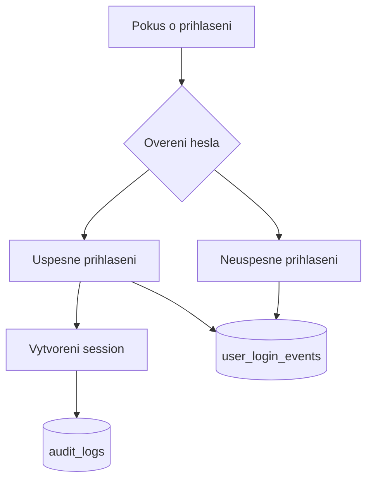

## Databaze zakazniku a naseptavac

Zakaznici se muzou vytvaret automaticky z objednavek. Hlavni identifikator je telefon, pripadne e-mail.

Kdyz prijde nova objednavka:

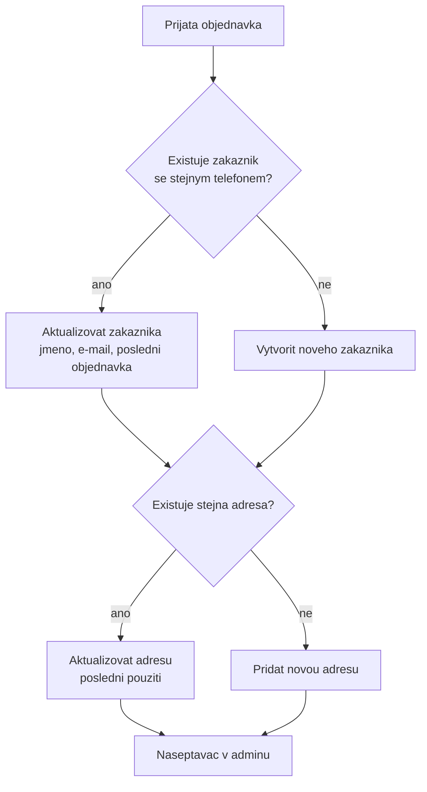

Naseptavac v adminu muze hledat podle:

- telefonu
- jmena
- e-mailu
- ulice
- mesta / casti obce

Vysledek naseptavace:

```txt
Jana Novakova
+420 777 123 456
Kraluv Dvur, Listice
12 objednavek, naposledy vcera
```

## Rozvozove zony

Zony jsou opsane z dodane fotky. Rucne dopsane a hur citelne obce jsou oznacene poznamkou `overit`.

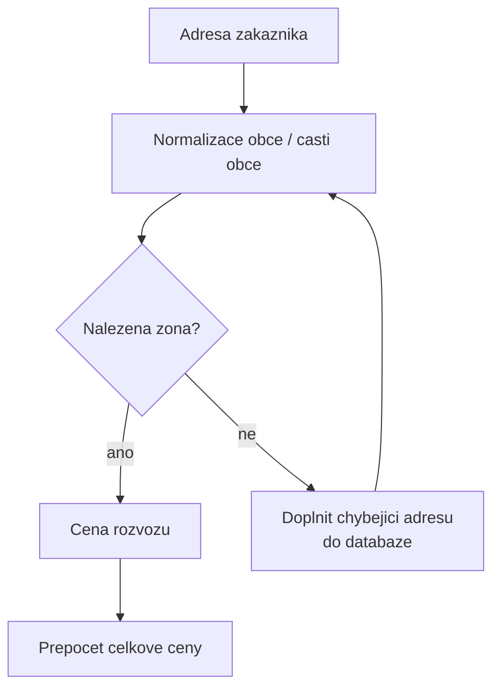

| Cena rozvozu | Obce / casti obce |
| ---: | --- |
| 0 Kc | Beroun |
| 20 Kc (1x pizza) | Kraluv Dvur, Listice |
| 40 Kc | Trubin |
| 50 Kc | Hyskov, Tetin, Krizatky, Zdejcina, Trubska |
| 60 Kc | Koneprusy, Zelezna, Cernin, Hostim |
| 80 Kc | Nizbor, Lodenice, Hudlice, Zdice, Srbsko, Male Prilepy, Chynava |
| 100 Kc | Chrustenice, Otrocinoves, Tman, Stradonice, Bubovice, Svata, Skuhrov, Skripel, Zloukovice, Svaty Jan pod Skalou |
| 120 Kc | Novy Jachymov |

Rozhodujici je upresneny seznam provozovatele z 10. 7. 2026. Databazova pravidla jsou v `database/addresses/zones.json`.

## Databaze adres a automaticka zona

Cil: admin ani ridic nevybira zonu rucne u objednavky. Zakaznik nebo admin vybere adresu z naseptavace a system sam doplni:

- obec / cast obce
- ulici
- cislo popisne / orientacni
- PSC
- rozvozovou zonu
- cenu rozvozu

Oficialni zdroj adres pro CR je RUIAN od CUZK. Pro produkci jsou vhodne dve varianty:

- adresni mista RUIAN ve formatu CSV
- vymenny format RUIAN VFR

Pro tento projekt je nejpragmatictejsi importovat adresni mista z RUIAN a omezit je jen na obce / casti obci, kam Pizza Bellizzi rozvazi.

Zdroje:

- https://cuzk.gov.cz/ruian/RUIAN.aspx
- https://cuzk.gov.cz/ruian/Poskytovani-udaju-ISUI-RUIAN-VDP/Vymenny-format-RUIAN-%28VFR%29.aspx
- https://geoportal.cuzk.cz/Default.aspx?lng=EN&metadataID=CZ-00025712-CUZK_SERIES-MD_RUIAN-CSV-ADR-ST&metadataXSL=Full&mode=TextMeta&side=dsady_RUIAN_vse

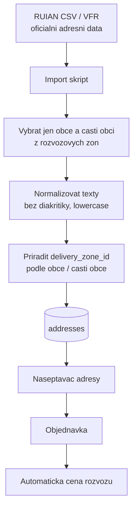

### Naseptavac adresy

Zakaznik i admin vyplnuji adresu pres naseptavac. Zapis objednavky ma idealne vzdy odkaz na `address_id`.

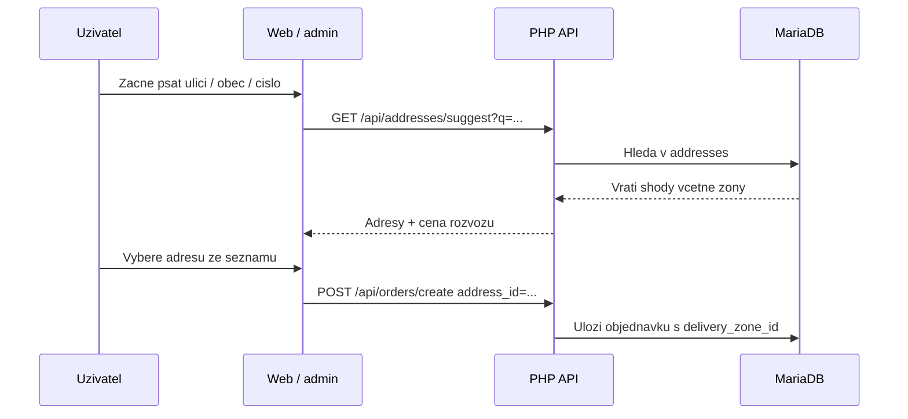

Priklad naseptavace:

```txt
Plzenska 86, Beroun-Mesto, 266 01 Beroun
Zona: Beroun / zakladni rozvoz

Listice 120, 266 01 Beroun
Zona: 20 Kc

Trubin 25, 267 01
Zona: 40 Kc
```

### Kdyz adresa v databazi chybi

Bez rucniho vyberu zony u objednavky. Admin pouze doplni adresu do databaze. Zona se dopocita podle obce / casti obce; pokud to nejde urcit, adresa se ulozi jako `needs_review`.

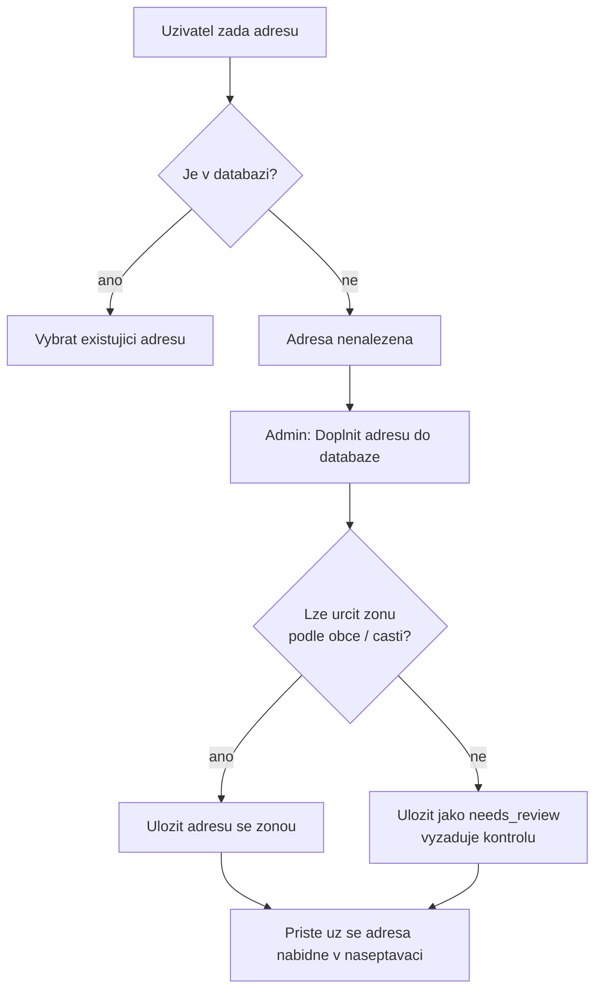

### Pravidlo prirazeni zony

Zony se neprirazuji ručně na objednavce. Prirazuji se automaticky podle tabulek:

```txt
addresses.delivery_zone_id
delivery_zone_places.normalized_place_name
delivery_zones.delivery_fee
```

Logika:

```txt
1. Zakaznik vybere adresu z addresses.
2. Objednavka prevezme address_id a delivery_zone_id.
3. Cena rozvozu se vezme z delivery_zones.delivery_fee.
4. Pokud adresa chybi, admin ji jednou doplni do addresses.
5. Dalsi objednavky uz pouziji ulozenou adresu automaticky.
```

## Navrh databaze

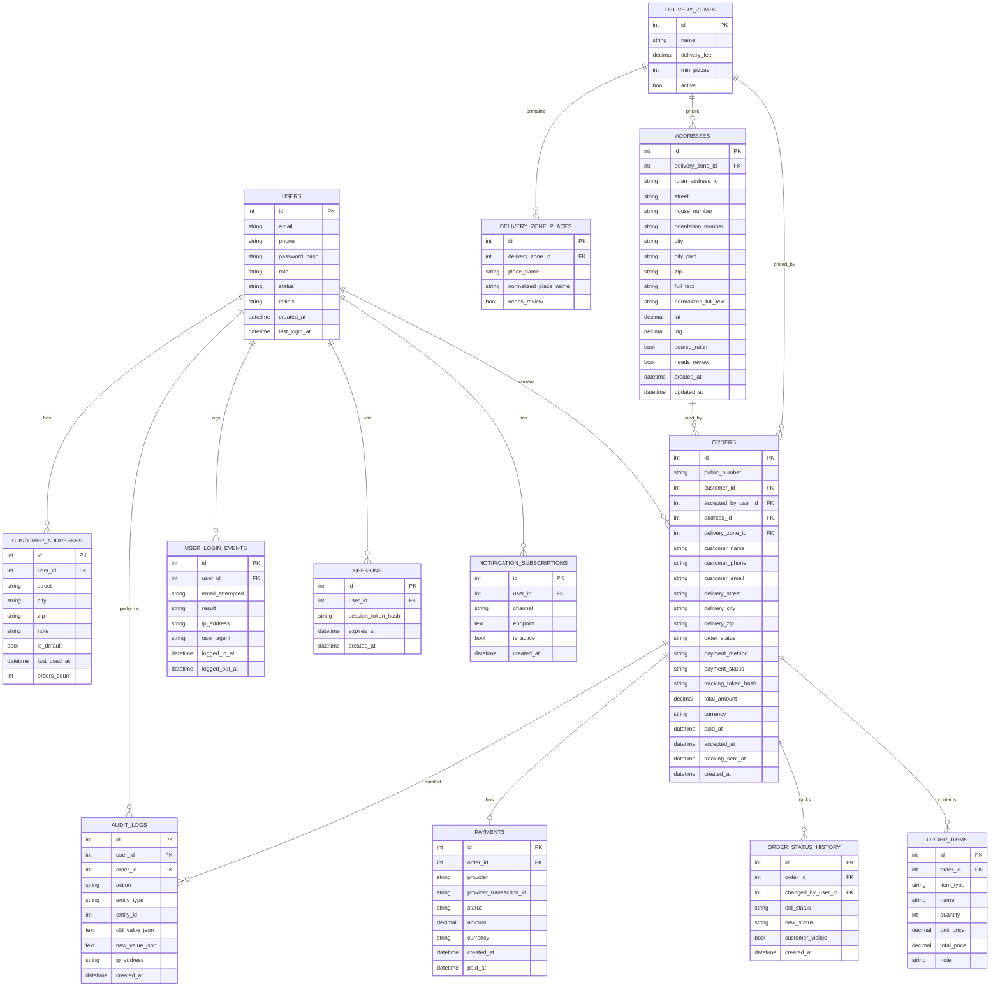

## Stavy objednavky

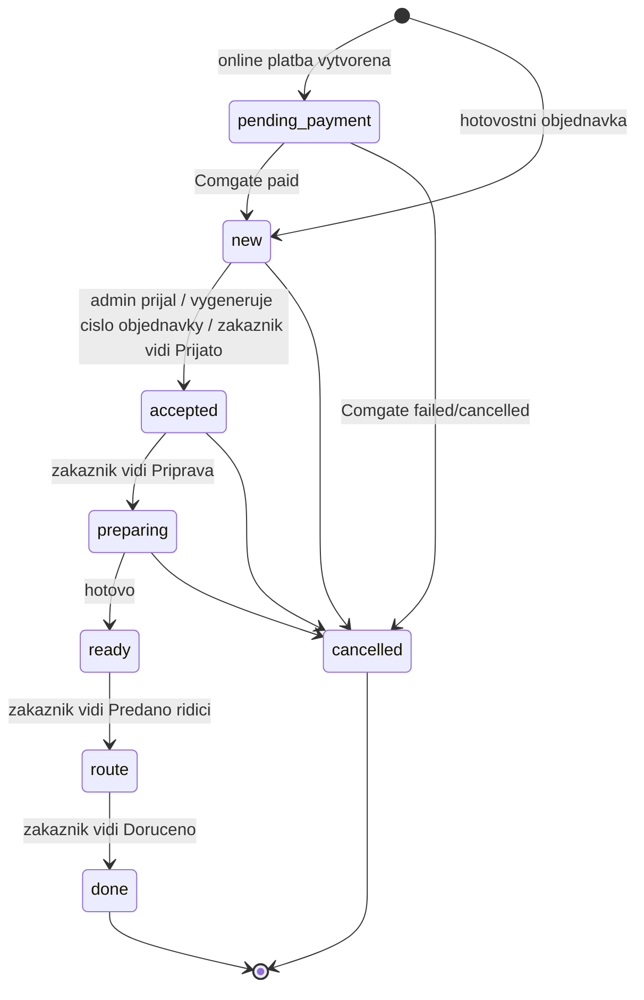

## API endpointy

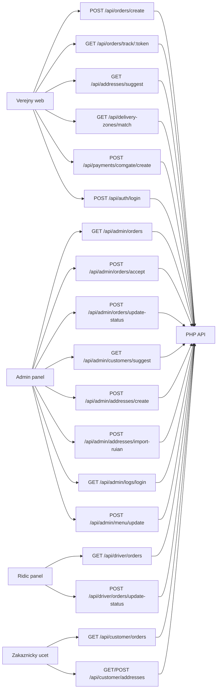

## Notifikace

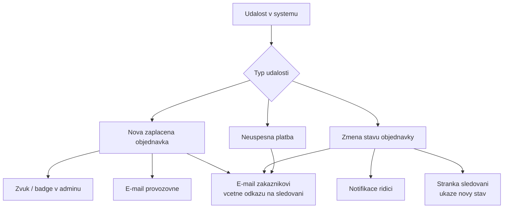

## Doporuceny stack

```txt
Frontend:
  HTML + CSS + JavaScript

Backend:
  PHP 8.2/8.3

Databaze:
  MariaDB

Platby:
  Comgate API + server callback

E-maily:
  SMTP / MailerSend / Postmark / SendGrid

Prihlaseni:
  PHP sessions nebo vlastni session tabulka
  password_hash()
  password_verify()

Hosting:
  PHP hosting nebo male VPS
```
